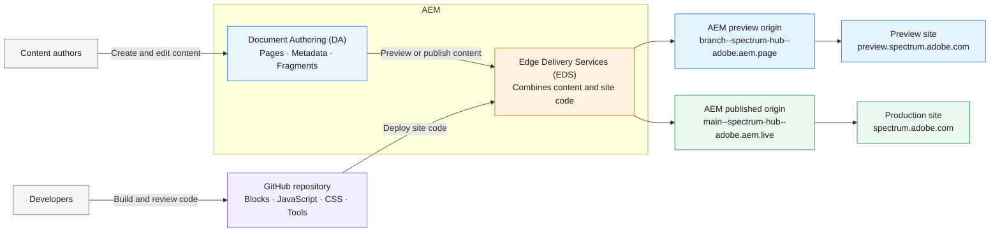
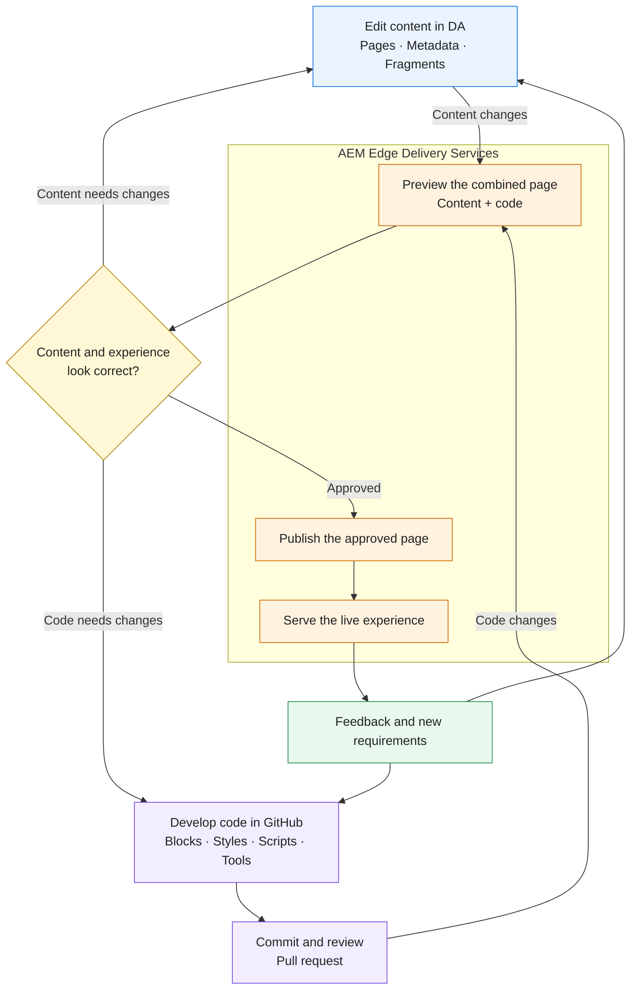

# Spectrum Hub

A unified view into the world of Spectrum, Adobe's design language.

## Mission

Our mission is to deepen Spectrum’s adoption through a multi‑platform website experience that goes beyond documentation. Showing the breadth of our multi-platform system through engaging, educating and inspiring moments. Delivering a future focused, scalable website able to adapt to the evolution of AI.

## Developing

Spectrum Hub is built on AEM Edge Delivery Services. Local development requires
Node.js 20 and npm.

1. Clone this project to your computer.
1. Run `nvm install` and `nvm use` to select the version in [`.nvmrc`](./.nvmrc).
1. Install project dependencies with `npm ci`.
1. Start the project-local AEM CLI with `npx aem up`.
1. Open the cloned folder in your code editor.

To use the AEM CLI globally instead, install it with
`npm install -g @adobe/aem-cli`, then run `aem up` in the cloned folder. Do not
use `sudo` for npm package installation; configure npm's global package
directory for your user if the command reports a permissions error.

### Testing

The core test command runs the Web Test Runner unit suite plus the Node-based
extraction, indexer, and link-check unit suites:

```bash
npm test
```

To re-run tests automatically as you edit:

```bash
npm run test:watch
```

To watch a single file:

```bash
npm run test:file:watch -- test/scripts/scripts.test.js
```

## Contributing

Start with [`CONTRIBUTING.md`](./CONTRIBUTING.md) and choose the workflow that
matches your change:

- **Engineers** change blocks, scripts, styles, tools, dependency pipelines, and
  edge code through GitHub.
- **Authors** change pages, metadata, and fragments through Document Authoring
  (DA). Content-only changes do not require a GitHub pull request.

### Contributor guides

| Guide | Use it when |
| --- | --- |
| [Architecture](./docs/ARCHITECTURE.md) | Tracing the page lifecycle, production request path, or code ownership boundaries |
| [Content authoring](./docs/CONTENT_AUTHORING.md) | Editing or debugging pages, metadata, fragments, preview, and publish behavior |
| [Blocks](./docs/BLOCKS.md) | Adding or changing an EDS block |
| [Tests](./docs/TESTS.md) | Choosing the correct local or CI validation |
| [Styles](./docs/STYLES.md) | Adding CSS, tokens, color schemes, responsive behavior, or motion |
| [Dependencies](./docs/DEPS.md) | Changing vendored code, extracted implementation data, mappings, or generated outputs |
| [Tools](./docs/TOOLS.md) | Changing DA tools, Sidekick integrations, the scheduler, or the Algolia indexer |

## Integrations

### Spectrum Design Data

[Spectrum Design Data](https://github.com/adobe/spectrum-design-data) is used to join the world of Spectrum with semantic HTML generated by AEM Edge Delivery Services.

### Spectrum Web Components & React Spectrum

[Spectrum Web Components](https://github.com/adobe/spectrum-web-components) and [React Spectrum](https://github.com/adobe/react-spectrum) have a daily GitHub Action that runs and feeds component statuses, available properties and sandbox implementations.

### Algolia Search

Semantic search and AI capabilities are provided by Algolia. Given the private
nature of some content, the indexer runs as a GitHub Action every 12 hours.

## Glossary

| Term | Meaning |
| --- | --- |
| **AEM** | Adobe Experience Manager, the platform that hosts authoring and Edge Delivery Services |
| **DA** | Document Authoring, where authors edit pages, metadata, and fragments |
| **EDS** | Edge Delivery Services, which combines authored content with repository code and serves preview and published pages |
| **Block** | A repository-owned component that decorates an authored table or generated block structure |
| **Fragment** | A separately authored document reused inside other pages, such as navigation |
| **RSP** | React Spectrum, an implementation source used by component status and playground data |
| **S2** | The current Spectrum 2 generation of React Spectrum components |
| **SWC** | Spectrum Web Components, the custom-element implementation source |
| **CEM** | Custom Elements Manifest, the machine-readable source used to extract SWC component metadata |
| **Sidekick** | The AEM browser extension that provides preview, publish, and custom authoring actions |

## Accessibility considerations

Spectrum Hub is committed to meeting WCAG 2.2 AA compliance. As a result, all content and features should be tested against these criteria.

### Prefers Reduced Motion

Spectrum Hub supports the `prefers-reduced-motion` media query. All animations and transitions should be tested with the setting enabled on a user OS level.

#### Current implementations with this codebase

- Sitenav
  - when `prefers-reduced-motion` is true, the sitenav will not animate its width changes.
- Header
  - when `prefers-reduced-motion` is true, the skip link will not animate the slide transitions.
- Pages
  - when `prefers-reduced-motion` is true, any jump/anchor links will fallback to native browser behavior.
  - when `prefers-reduced-motion` is true, the page will not animate its navigation view transition.
- Cards
  - when `prefers-reduced-motion` is true, cards will not animate their scale changes on hover.

### Testing

Automated accessibility testing (axe-core WCAG 2.2 AA scans and accessibility-tree checks) is covered in [`test/a11y/README.md`](./test/a11y/README.md). `prefers-reduced-motion` behavior itself should be verified manually by enabling the setting at the OS level.

To run Playwright/Axe automated accessibility tests:

```bash
npx playwright install chromium
npm run test:a11y
```

## How engineering and content merge



## Authoring and development lifecycle


