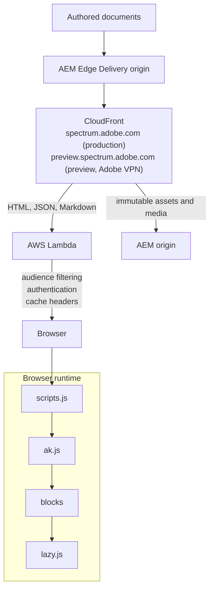

# Architecture

This guide explains how Spectrum Hub code, authored content, AEM Edge Delivery
Services, and the production edge layer work together. It is intended for code
contributors who need to decide where a change belongs.

## System overview

Spectrum Hub is a document-authored website built on AEM Edge Delivery Services
(EDS). Most page content is authored outside this repository. This repository
contains the browser runtime, blocks, styles, generated component data, tests,
authoring tools, and the edge code that protects private content.



The production edge implementation is `workers/website-lambda/`, deployed as an
AWS Lambda Function URL behind CloudFront. `workers/website/` is the earlier
Cloudflare Worker implementation and remains useful as a reference, but it is
not the current production path.

## Repository map

| Path | Responsibility |
| --- | --- |
| `scripts/scripts.js` | Project-level page setup and runtime configuration |
| `scripts/ak.js` | Shared EDS decoration and loading primitives |
| `scripts/lazy.js` | Work deferred until all page sections have loaded |
| `blocks/` | Page features loaded on demand by block name |
| `styles/` | Global fonts, tokens, element styles, layout, and utilities |
| `deps/` | Runtime dependencies and generated component-status/property data |
| `tools/` | Authoring utilities, indexer, and local development tools |
| `workers/website-lambda/` | Current AWS Lambda/CloudFront edge implementation |
| `workers/website/` | Legacy/reference Cloudflare Worker implementation |
| `test/` | Unit, extraction, accessibility, indexer, and link-check tests |
| `.github/workflows/` | Pull-request checks and scheduled data/index jobs |

## Production request path

The current production edge is documented in detail in
[`workers/website-lambda/README.md`](../workers/website-lambda/README.md).

At a high level:

- CloudFront sends HTML, JSON, Markdown, and other viewer-dependent requests through the Lambda.
- Static assets and immutable media can go directly to AEM.
- The Lambda proxies AEM, validates sessions, filters private pages and `audience-*` content, and filters `query-index.json` and `sitemap.xml`.
- Anonymous responses are cached according to environment-specific policy.
- Secrets are resolved from AWS Secrets Manager and failures degrade closed, never open.

Preview and production intentionally differ. Stage uses the `aem.page` origin
and disables anonymous caching; production uses `aem.live` and CloudFront
caching with push invalidation.

## Main integrations

| Integration | Where it enters the system |
| --- | --- |
| AEM Edge Delivery Services | Authored pages, fragments, query index, preview, and publish |
| Adobe IMS | Browser sign-in plus Lambda session creation and allowlist checks |
| Algolia | Search UI in `blocks/search/` and scheduled indexing in `tools/indexer/` |
| React Spectrum S2 | Generated component property data under `deps/rsp/` |
| Spectrum Web Components | Generated property data under `deps/swc/` and runtime custom elements |
| Figma/Spectrum design data | Component design availability and links in generated status data |
| GitHub Actions | Tests, linting, data extraction, Algolia indexing, and link crawling |

## Browser page lifecycle

### 1. Top-level page setup

`scripts/scripts.js` runs on every page. Before loading page blocks it:

1. Adds the `spectrum-edge` class to the document.
2. Restores the visitor's color scheme.
3. Reads page metadata such as `template`, `hero`, and `breadcrumbs`.
4. Configures host rewriting, link-triggered blocks, CSS opt-outs, locale, and the project-specific `decorateArea` callback.
5. Checks whether an IMS-backed session may exist.
6. Loads navigation early for returning visitors.
7. Creates automatic page structures, including page heroes and breadcrumbs.
8. Calls `loadArea()` from `scripts/ak.js`.

Keep `scripts.js` generic. A feature that belongs to one block should normally
live in that block's `init()` function rather than adding block-specific logic to
the page loader.

### 2. Area decoration and block loading

`loadArea()` in `scripts/ak.js` turns EDS markup into the runtime page:

1. Decorates document-level structures such as the header.
2. Runs the configured project decoration hook.
3. Resolves audience-gated content before loading hidden blocks.
4. Removes empty sections and decorates pictures.
5. Groups section children into `.default-content` and `.block-content`.
6. Converts recognized links into automatic blocks.
7. Loads icons.
8. Loads link-triggered and authored blocks section by section.
9. Starts session navigation after the first section for a new visitor.
10. Imports `scripts/lazy.js` after every section is complete.

Blocks in one group load in parallel. Sections load in document order, so the
earliest content gets priority without feature-specific scheduling.

### 3. Block resolution

`loadBlock()` uses the first class on an element as the block name:

```html
<div class="card vertical">...</div>
```

The example loads:

- `blocks/card/card.js`
- `blocks/card/card.css`

The additional `vertical` class is a variant and does not affect module
resolution. The `fragment` and `profile` blocks are CSS opt-outs in
`scripts.js`; all other blocks load a matching stylesheet automatically.

See [Blocks](./BLOCKS.md) for the complete contract.

### 4. Deferred work

`scripts/lazy.js` loads features that are not required for initial page content:

- hash restoration
- favicon selection
- footer initialization
- real-user monitoring
- non-production scheduler and sidekick integration

`scripts/postlcp.js` exists but is not imported by the current lifecycle. Do not
assume it runs after LCP without first wiring and measuring that behavior.

## Where a change belongs

| Change | Preferred location |
| --- | --- |
| Feature used by one block | That block's JavaScript and CSS |
| Reusable browser helper | `scripts/utils/`, with focused tests |
| Universal page setup | `scripts/scripts.js`, only when every relevant page needs it |
| Generic EDS decoration/loading | `scripts/ak.js`, with lifecycle tests |
| Non-critical page work | `scripts/lazy.js` |
| Global tokens, elements, or utilities | `styles/styles.css` |
| Per-viewer access or response filtering | `workers/website-lambda/` |
| Content extraction or generated status data | `deps/` pipeline |
| Search record generation | `tools/indexer/` |

Changes to `scripts.js`, `ak.js`, authentication, caching, or generated-data
contracts have broad impact. Read the subsystem documentation and run its
targeted tests before changing those boundaries. Most often, changes to `scripts.js`
or `ak.js` should be avoided.

## Related guides

- [Content authoring](./CONTENT_AUTHORING.md)
- [Blocks](./BLOCKS.md)
- [Styles](./STYLES.md)
- [Tests](./TESTS.md)
- [Dependencies and generated data](./DEPS.md)
- [Tools](./TOOLS.md)
