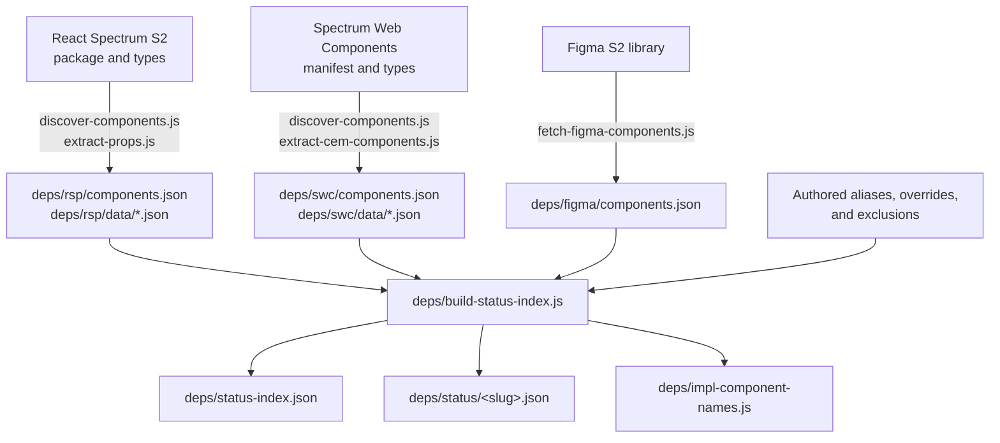

# Dependencies and generated data

The `deps/` directory contains more than third-party libraries. It also contains
generated component catalogs, authored mapping inputs, build scripts, and data
contracts consumed by blocks. Treat each category differently.

## Directory categories

| Category | Examples | Change policy |
| --- | --- | --- |
| Vendored browser dependencies | `deps/lit/`, `deps/turndown/`, `deps/components/swc-tooltip/` | Edit `src/index.js`, then rerun the corresponding `npm run build:*` script |
| Authored runtime components | `deps/se/` | Edit the source in place; there is no upstream package or build step |
| Extraction source data | `deps/rsp/data/`, `deps/swc/data/`, `deps/figma/components.json` | Regenerate from upstream sources |
| Authored mappings and overrides | `component-aliases.json`, `status-overrides.json`, `roster-excludes.json` | Edit intentionally, then rebuild |
| Generated status outputs | `status-index.json`, `status/<slug>.json`, `impl-component-names.js` | Never hand-edit |
| Extraction/build code | `deps/rsp/*.js`, `deps/swc/*.js`, `deps/shared/`, `build-status-index.js` | Change with tests and regenerate outputs |
| Playground/runtime assets | `deps/rsp/playground/`, `deps/swc/components.json` | Follow the subsystem contract |

Do not assume that everything under `deps/` is safe to replace with an npm
package or safe to edit as source. [`deps/README.md`](../deps/README.md) describes
the `src/` and `dist/` layout the vendored dependencies share.

## Component data flow

Spectrum Hub combines implementation data from React Spectrum S2 (RSP),
Spectrum Web Components (SWC), and Figma:



The generated outputs feed:

| Consumer | Reads |
| --- | --- |
| `blocks/status-table/` | `deps/status-index.json`, for the complete implementation matrix |
| `blocks/component-status/` | `deps/status/<slug>.json`, for one component's status pills |
| `scripts/utils/figma.js` | `deps/status/<slug>.json`, for the `figmaPageId` behind the "See in Figma" link |
| `scripts/utils/go-to-impl.js` | `deps/impl-component-names.js`, for upstream documentation links |
| `blocks/playground/` | `deps/impl-component-names.js` for export names, plus the raw `deps/rsp/data` and `deps/swc/data` catalogs |

`component-status` and `figma.js` read the same per-component slice, but it is fetched
once: `scripts/utils/component-slice.js` memoizes `deps/status/<slug>.json` by slug for
the page's lifetime. Reading it through that helper also means both see the same
override-resolved data, so a `figmaPageSource` override in `deps/status-overrides.json`
applies to the link and the pills alike.

Status consumers should read the generated model, not independently reinterpret
raw RSP, SWC, or Figma status values. The playground intentionally reads raw
RSP/SWC prop catalogs because it needs property-level control metadata that is
not part of the combined status model.

## Authored inputs

Edit these files for intentional re-mappings:

| File | Purpose |
| --- | --- |
| `deps/component-aliases.json` | Reconciles source-specific names with canonical component names and documentation names |
| `deps/status-overrides.json` | Overrides automatically detected status or link data |
| `deps/roster-excludes.json` | Removes composition parts that should not appear as standalone components |
| `deps/rsp/rsp-secondary-status.json` | Adds RSP guidance below a primary status |
| `deps/swc/swc-secondary-status.json` | Adds SWC guidance below a primary status |
| `deps/figma/figma-secondary-status.json` | Adds Figma guidance below a primary status |

After editing any of these, regenerate and inspect the combined outputs:

```bash
node deps/build-status-index.js
npm run test:extractions
```

## Generated files

Never hand-edit:

- `deps/status-index.json`
- `deps/status/<slug>.json`
- `deps/impl-component-names.js`
- `deps/rsp/components.json`
- `deps/rsp/data/*.json`
- `deps/swc/components.json`
- `deps/swc/data/*.json`

Only `deps/impl-component-names.js` carries a marker, because it is the one generated
output in the list above that can hold a comment:

```js
// Generated by deps/build-status-index.js — do not edit by hand.
```

Every other path above is JSON, which cannot. Treat the list itself as the authority on
what is generated rather than looking for a header inside the file.

When generated output looks wrong, fix the authored mapping, extractor, status
model, or upstream source that produced it. A direct output edit will disappear
on the next scheduled extraction.

## React Spectrum S2 extraction

`deps/rsp/` discovers published S2 components, follows their TypeScript
declaration graphs, and uses the TypeScript checker (`deps/rsp/build-ts-checker.js`) to resolve inherited props,
unions, and `Omit`/`Pick` behavior.

Run:

```bash
node deps/rsp/discover-components.js
node deps/rsp/extract-props.js
node deps/build-status-index.js
npm run test:extractions
```

The extraction fetches published package files and can take several minutes.
`discover-components.js` rewrites the generated roster; `extract-props.js`
rewrites per-component data and removes stale files with a fail-closed roster
size guard.

Read [`deps/rsp/README.md`](../deps/rsp/README.md) before changing type
resolution, package crawling, component discovery, or playground naming.

## Spectrum Web Components extraction

`deps/swc/` reads the published second-generation SWC Custom Elements Manifest
and resolves attribute types against the package's TypeScript declarations (`deps/swc/build-ts-checker.js`).

Run against the published manifest:

```bash
node deps/swc/discover-components.js
node deps/swc/extract-cem-components.js
node deps/build-status-index.js
npm run test:extractions
```

Both scripts also accept a local CEM path when validating unreleased SWC work.
Published extraction follows the `latest` distribution tag and records its
resolved concrete version in `deps/swc/version.json`. Read
[`deps/swc/README.md`](../deps/swc/README.md) before changing version or source
handling.

## Combined status build

`deps/build-status-index.js`:

1. reads RSP, SWC, and Figma rosters
2. resolves aliases to canonical names
3. maps source-specific states to the unified status vocabulary
4. applies secondary status guidance
5. applies manual overrides
6. removes roster exclusions
7. writes the complete index, component slices, and name map

Run it directly:

```bash
node deps/build-status-index.js
```

Review both the expected component and unexpected neighboring changes. Alias and
status-model edits can affect many rows.

## Data contracts

The detailed contracts under `deps/docs/` are authoritative for the generated
models:

| Document | Read it when |
| --- | --- |
| [`STATUS-FILES.md`](../deps/docs/STATUS-FILES.md) | Choosing which mapping/status file to edit or tracing an output |
| [`DATA-CONTRACT.md`](../deps/docs/DATA-CONTRACT.md) | Changing source status vocabularies or the unified status model |
| [`PLAYGROUND-CONTRACT.md`](../deps/docs/PLAYGROUND-CONTRACT.md) | Changing property controls, snippets, component names, or playground lookups |
| [`REMOVED-DETECTION.md`](../deps/docs/REMOVED-DETECTION.md) | Changing how removed components are detected |

`deps/impl-component-names.js` carries two fields per component, and they are not
interchangeable:

- `docs` names the page the implementation's own documentation site publishes it on. It
  is many-to-one: RSP's `AlertDialog`, `Dialog`, and `FullscreenDialog` all link to
  `Dialog.html`.
- `export` names what to import and render. It is one-to-one: `FullscreenDialog` is its
  own component even though its docs redirect to `Dialog`'s page.

Collapsing the two fields into one value has shipped a bug before. Read the field that
answers your question: `docs` to build a documentation link, `export` to name the
component in code.

## Automation

GitHub workflows regenerate upstream-derived RSP and SWC data on a schedule,
commit changes to bot-owned branches, and create or update pull requests. The
status build runs after source extraction so each pull request keeps the source
data and combined outputs synchronized.

When an automation diff is unexpectedly large:

1. Check whether the upstream package or manifest changed.
2. Read extractor warnings.
3. Run `npm run test:extractions`.
4. Inspect roster additions/removals and several representative property files.
5. Rebuild the combined status index locally.
6. Do not mask the change with manual edits to generated output.

## Safe change checklist

1. Identify whether the target is authored, generated, vendored, or build logic.
2. Read the owning README/data contract.
3. Edit the source of truth.
4. Run the exact regeneration command.
5. Run `npm run test:extractions`.
6. Review generated additions, removals, and renames.
7. Include source and regenerated outputs in the same change.

## Related guides

- [Architecture](./ARCHITECTURE.md)
- [Blocks](./BLOCKS.md)
- [Tests](./TESTS.md)
- [Tools](./TOOLS.md)
